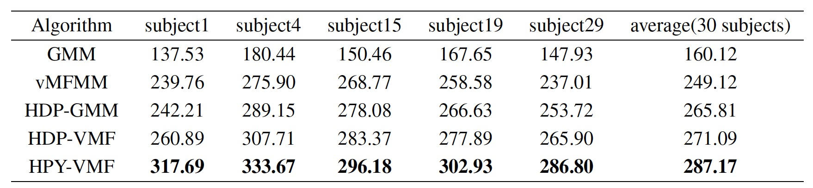

# Grouped Spherical Data Modeling Trough Hierarchical Nonparametric Bayesian Models and Its Application to fMRI Data Analysis

## Requirements

To install requirements:

```setup
conda env create -f environment.yml
conda activate Test
```

## File

    datas  # container of data  
    result # container figure of result  
    config.py # the hyper parameters of dataset  
    model.py # hdp-vmf model code  
    utils.py # some util functions  
    train_synthetic.py # training code of synthetic data  
    train_brain.py # training code of fMRI data  
    cluster_process.py # fMRI process code  

## Training

To train the model(s) in the paper, run this command:  

    __params:__  
    -name dataset name  
    -lp Load hyper parameter or not 
    -verbose print information or not  

    -k first truncation of model  
    -t second truncation of model  
    -tau stick hyper params of fist level  
    -gamma stick hyper params of second level  
    -th second level threshold of converge   
    -mth the threshold of Cluster number  
    -sm second level max iteration  
    -m max iterations of training  

```train
python train_synthetic.py -name small_data -lp 1 -verbose 1 -k 10 -t 5 -tau 1 -gamma 1 -th 1e-7 -mth 0.011 -sm -1 -m 10
or
python train_brain.py -name adhd -lp 1 -verbose 1 -k 150 -t 45 -tau 10 -gamma 1 -th 1e-7 -mth 0.01 -sm -1 -m 12
```

## Results

Our model achieves the following performance with CH score on :




